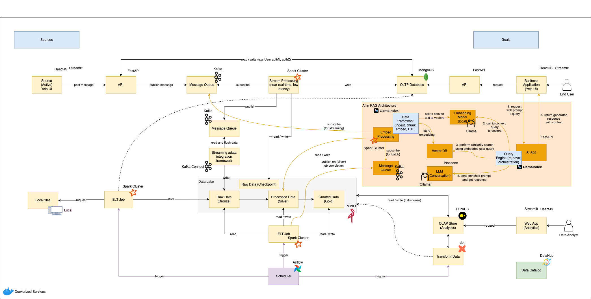

# AI-Enabled Data Platform for Yelp Analytics

This repository contains an end-to-end data, analytics, and AI platform
combining **real-time streaming, batch ELT, Data Lakehouse, RAG/LLM
services, and analytics applications**.\
It is designed as a clear, modular monorepo where each part of the
architecture is easy to understand, extend, and run locally.

------------------------------------------------------------------------

## 🚀 High-Level Architecture



The platform supports:

-   **Real-time ingestion** using FastAPI → Kafka → Spark Structured
    Streaming\
-   **Batch ELT** using Spark + Airflow → MinIO Lakehouse\
-   **Lakehouse storage** (Bronze, Silver, Gold)\
-   **Analytics transformations** using dbt + DuckDB\
-   **AI stack (RAG)** with embeddings, vector search, and LLM
    orchestration\
-   **Business-facing UI** using Streamlit or React\
-   **Metadata management** with DataHub

------------------------------------------------------------------------

## 📁 Repository Structure

```sh
.
├── README.md
├── docs/                     # Architecture diagrams, ADRs, data contracts, schema docs
│   ├── architecture/
│   ├── data-models/
│   └── rag-design/
│
├── apps/                     # All runnable services (microservices)
│   ├── ui/
│   │   ├── streamlit/        # Analytics or business UI 
│   │   └── react/            # (if you have a separate frontend)
│   │
│   ├── api/
│   │   └── fastapi/          # REST APIs (source ingestion, AI orchestration, users)
│   │
│   ├── ai/                   # RAG / embedding / LLM services
│   │   ├── embeddings/       # embedding pipeline (Ollama, BGE, etc.)
│   │   ├── llm/              # LLM orchestration (LlamaIndex, prompt templates)
│   │   ├── vectordb/         # Pinecone / Chroma integration
│   │   └── retriever/        # Query engine, reranking, hybrid search, etc.
│   │
│   ├── streaming/            # Real-time streaming components
│   │   ├── kafka/            # topics, producers, consumers
│   │   └── spark_streaming/  # structured streaming jobs
│   │
│   ├── batch/                # Batch / scheduled processing
│   │   ├── spark/            # ELT jobs (bronze/silver/gold)
│   │   ├── airflow/          # DAGs orchestrating batch jobs
│   │   └── dbt/              # Transform layer for analytics (gold → OLAP)
│   │
│   ├── storage/
│   │   ├── minio/            # Lakehouse object storage interface
│   │   └── mongodb/          # OLTP / metadata store
│   │
│   ├── analytics/            # Analytics services
│   │   ├── duckdb/           # OLAP store
│   │   └── notebooks/        # Analysis notebooks
│   │
│   └── datahub/              # Catalog + lineage
│
├── pipelines/                # End-to-end data/AI pipelines
│   ├── ingestion/
│   ├── embeddings/
│   ├── training/
│   ├── batch/
│   └── streaming/
│
├── data/                     # Local sample data, exports, fixtures
│   ├── raw/
│   ├── bronze/
│   ├── silver/
│   └── gold/
│
├── infra/                    # Infrastructure as code (Docker/K8s/Terraform)
│   ├── docker/
│   ├── compose/
│   ├── terraform/
│   └── configs/
│
├── libs/                     # Shared libraries
│   ├── utils/
│   ├── common_schemas/
│   ├── logging/
│   └── monitoring/
│
├── assets/                   # Images, logos, diagrams
└── tests/                    # All tests
    ├── unit/
    ├── integration/
    └── e2e/
```

------------------------------------------------------------------------

## 🧩 Platform Components

### API Layer

-   FastAPI for ingestion
-   Authentication, validation, routing

### Streaming Layer

-   Kafka topics for ingestion
-   Spark Structured Streaming for real-time processing

### Data Lakehouse

-   MinIO S3-compatible storage\
-   Delta/Lake Bronze → Silver → Gold

### Batch Layer

-   Spark ELT\
-   Airflow scheduler\
-   dbt transformations

### Analytics

-   DuckDB OLAP engine\
-   Streamlit / React dashboards

### AI (RAG)

-   Embeddings (Ollama/HF)
-   Vector DB (Chroma/Pinecone)
-   LlamaIndex orchestration

### Metadata

-   DataHub lineage + governance

------------------------------------------------------------------------

## 🧪 Testing

    tests/
    ├── unit/
    ├── integration/
    └── e2e/

------------------------------------------------------------------------

## ▶️ Running Locally

    docker compose up -d

------------------------------------------------------------------------

## 🤝 Contributing

See `/docs/` for architecture, data contracts, and conventions.

------------------------------------------------------------------------

## 🗺️ Roadmap

-   [ ] Automated embeddings pipeline\
-   [ ] Model fine-tuning module\
-   [ ] SCD2 dimensions\
-   [ ] Feature store\
-   [ ] MLflow

------------------------------------------------------------------------

## 📄 License

MIT or organization license.
